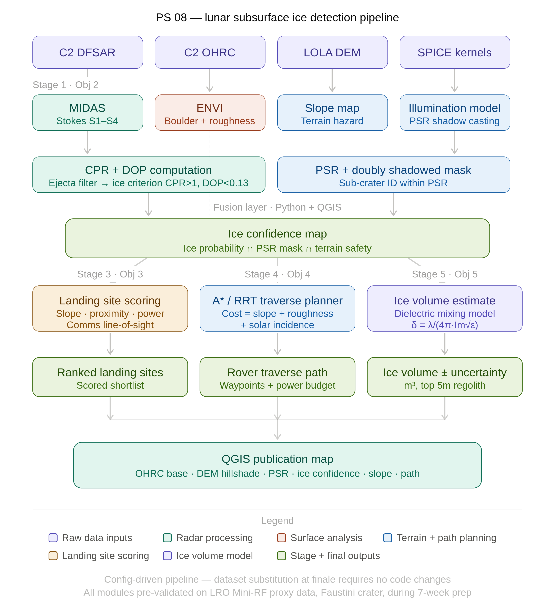
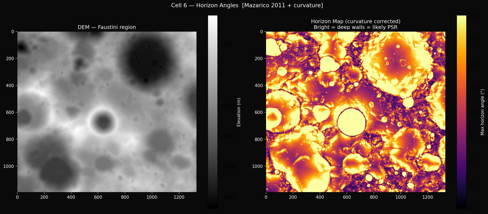
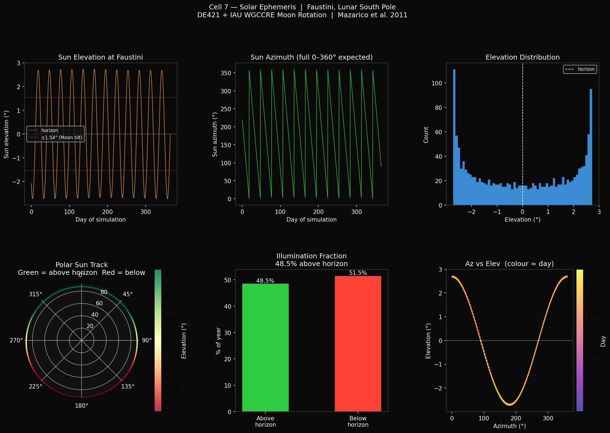
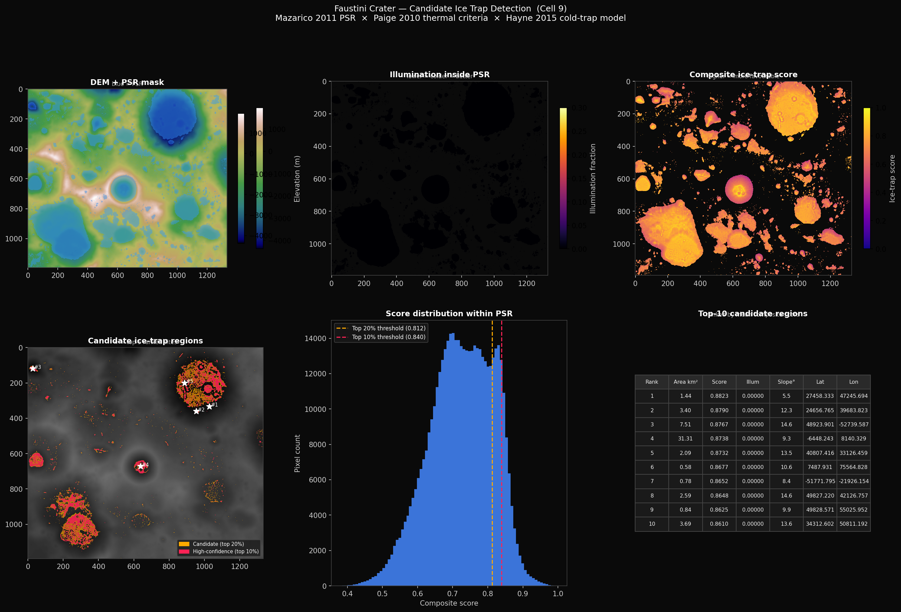
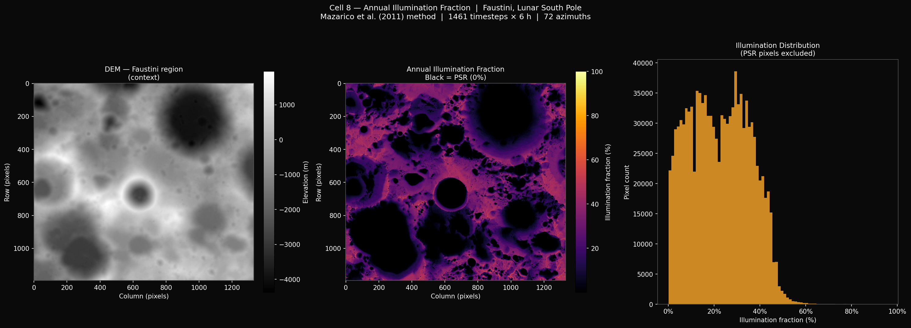
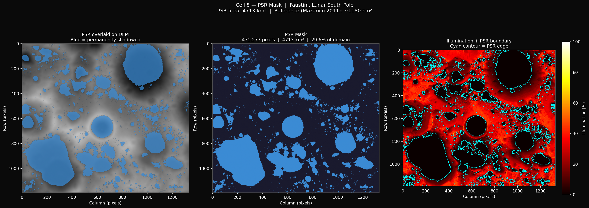
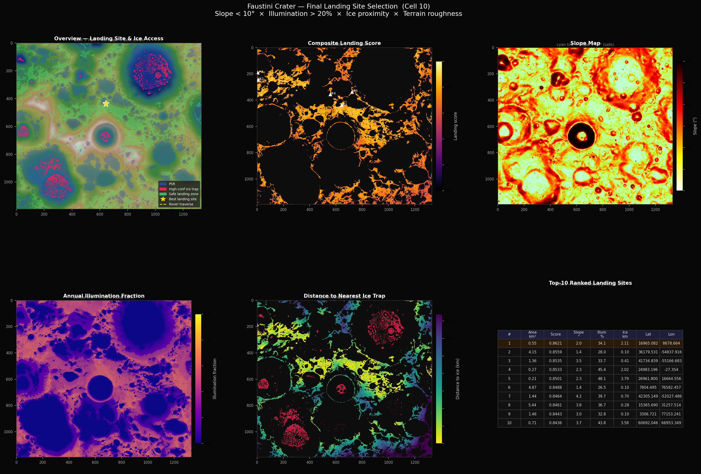

<div align="center">

# 🌕 LIRAF

### Lunar Integrated Resource Assessment Framework

**Terrain Analysis Module for Lunar South Pole Exploration**

*Bharatiya Antariksh Hackathon 2026 • Team LunaForge • NIT Patna*


</div>

---

> **Scope of this repository.** This repository documents and packages the **Terrain Analysis module** of LIRAF — DEM processing, horizon-angle modeling, solar illumination, PSR mapping, candidate ice-trap detection, and landing-site scoring — developed and verified by **Anjali Saini**. Radar processing (CPR/DOP), multi-source data fusion (GMM), and rover traverse planning are separate modules owned by other LunaForge teammates. See [`docs/team_contributions.md`](docs/team_contributions.md) for the full, honest attribution breakdown.

## ✨ Highlights

- 🌑 Permanent Shadow Region (PSR) Mapping
- 🛰️ Solar Ephemeris Modeling using Astropy
- 🧭 Curvature-Corrected Horizon Angle Computation
- ❄️ Candidate Ice Trap Detection
- 🚀 Landing Site Selection Framework
- 📊 Scientific Visualization Pipeline
- 📦 Modular Python Package

## Table of Contents

1. [Project Overview](#project-overview)
2. [Motivation](#motivation)
3. [Key Features](#key-features)
4. [Repository Structure](#repository-structure)
5. [Methodology Overview](#methodology-overview)
6. [Results](#results)
7. [Installation](#installation)
8. [Quick Start](#quick-start)
9. [Project Outputs](#project-outputs)
10. [Technology Stack](#technology-stack)
11. [Team Contributions](#team-contributions)
12. [Roadmap](#Roadmap)
13. [Citation](#citation)
14. [License](#license)

---

## Project Overview

LIRAF (Lunar Integrated Resource Assessment Framework) is Team LunaForge's decision-support system for lunar south-pole exploration, built for **Challenge 8** of the Bharatiya Antariksh Hackathon (BAH) 2026: detecting and characterizing subsurface ice using Chandrayaan-2 radar and imagery data, in support of landing-site and rover-traverse planning.

This repository covers the **Terrain Analysis** module — the piece of LIRAF responsible for turning a raw lunar DEM into the geometric and illumination information the rest of the pipeline depends on: where the Sun can and can't reach, where permanently shadowed ice-trapping terrain is likely to exist, and where a lander could safely touch down near it.

The target region is **Faustini crater** (87.3°S, 77.0°E), a well-studied lunar south-pole PSR candidate.

## Pipeline Architecture

<p align="center">

</p>

## Motivation

The lunar south pole's Permanently Shadowed Regions (PSRs) are believed to preserve water ice that could support In-Situ Resource Utilization (ISRU) — oxygen, life support, and propellant production for future missions. But no single instrument can confirm ice on its own: radar reveals subsurface scattering ambiguously, hydrogen data indicates volatile enrichment at coarse resolution, and terrain/illumination data only tells you where shadow *could* preserve ice, not whether it does. Mission planning adds a further constraint most detection-only studies ignore: an ice deposit is only useful if a lander can safely reach it and a rover can traverse to it.

This module addresses the terrain side of that problem: precisely modeling which pixels are permanently shadowed, which of those are the most physically favorable cold traps, and which nearby illuminated, low-slope terrain could support a real landing.

## Key Features

- **Curvature-corrected horizon-angle modeling** across 72 azimuth directions, following Mazarico et al. (2011)
- **Solar ephemeris computation** in the Moon-Centered Moon-Fixed (MCMF) frame using Astropy's DE421 ephemeris and a manual IAU WGCCRE Moon-rotation implementation
- **Annual illumination-fraction mapping** and boolean **PSR mask** derivation
- **Candidate ice-trap detection** inside PSRs, combining illumination, local topographic depression, slope, and depth-below-rim into a weighted composite score, with connected-component region ranking
- **Landing-site selection**, applying hard safety constraints (slope, illumination, roughness) plus a weighted composite score balancing safety against ice-trap proximity, with a scientifically-justified primary recommendation
- **Standalone terrain products**: gradient-based slope map and analytical hillshade, exported as GeoTIFFs
- A **modular, importable Python package** (`src/terrain_analysis/`) extracted faithfully from the original research notebook — not a rewrite, a refactor

## Repository Structure

```
LIRAF/
├── README.md
├── LICENSE
├── CITATION.cff
├── requirements.txt
├── .gitignore
│
├── docs/
│   ├── architecture.md         # Pipeline architecture & module responsibilities
│   ├── methodology.md          # Scientific methodology, formulas, citations
│   ├── datasets.md             # Dataset sources, projections, download instructions
│   ├── team_contributions.md   # Honest, verified per-teammate attribution
│   └── references.md           # Full literature reference list
│
├── notebooks/
│   └── terrain_analysis/
│       ├── PSR_Mapping.ipynb            # Cleaned, documented, publication-ready
│       └── PSR_Mapping_original.ipynb   # Original working notebook (archival)
│
├── src/
│   └── terrain_analysis/       # Reusable modules extracted from the notebook
│       ├── utils.py
│       ├── horizon_angles.py
│       ├── illumination.py
│       ├── ice_trap_detection.py
│       ├── landing_site_scoring.py
│       └── terrain_processing.py
│
├── qgis/                       # QGIS project, styles, layouts (pending upload)
│   ├── styles/
│   └── layouts/
│
├── config/
│   └── faustini_params.yaml    # Centralized pipeline parameters
│
├── outputs/
│   ├── rasters/                # slope_map.tif, hillshade.tif
│   ├── arrays/                 # small .npy arrays (large ones excluded, see datasets.md)
│   ├── tables/                 # JSON catalogues, sample CSV
│   └── figures/                # Diagnostic and publication figures (.png)
│
├── assets/
│   └── images/                 # README visuals
│
├── examples/
│   └── quickstart.md           # Minimal reproduction walkthrough
│
└── tests/
    └── test_terrain_analysis.py
```

## Methodology Overview

```
Faustini DEM (LOLA, 100 m/px)
        │
        ▼
Horizon-Angle Modeling  ── 72 azimuths, curvature-corrected (Mazarico et al. 2011)
        │
        ▼
Solar Ephemeris  ── DE421 + IAU WGCCRE rotation, MCMF frame
        │
        ▼
Illumination Fraction + PSR Mask
        │
        ├──────────────────────────────┐
        ▼                              ▼
Candidate Ice-Trap Detection    Slope & Hillshade (standalone terrain products)
        │
        ▼
Landing-Site Selection  ── hard safety gates + weighted composite score
```

Full formulas, thresholds, and scientific citations for every stage are documented in [`docs/methodology.md`](docs/methodology.md); module-level responsibilities and data flow are documented in [`docs/architecture.md`](docs/architecture.md).

## Results

The figures below are generated directly by the pipeline (see `notebooks/terrain_analysis/PSR_Mapping.ipynb`, Sections 2–7) and saved to `outputs/figures/`.

| Figure | Description |
|---|---|
| `outputs/figures/06_horizon_diagnostic.png` | DEM context alongside the maximum horizon angle per pixel — bright regions indicate deep terrain walls, a precondition for permanent shadow |
| `outputs/figures/07_solar_ephemeris.png` | Six-panel solar-position diagnostic: elevation/azimuth time series, elevation histogram, polar Sun track, illumination-fraction summary, and azimuth-vs-elevation colored by day |
| `outputs/figures/08_illumination_fraction.png` | DEM context, annual illumination-fraction map, and illumination-distribution histogram (PSR pixels excluded) |
| `outputs/figures/08_psr_mask.png` | PSR mask overlaid on the DEM, standalone PSR mask, and illumination map with PSR boundary contour |
| `outputs/figures/09_candidate_ice_traps.png` | Six-panel figure: DEM+PSR, in-PSR illumination, composite ice-trap score, candidate/high-confidence tier map with top-5 sites marked, score distribution, and ranked-region table |
| `outputs/figures/10_landing_site_selection.png` | Six-panel figure: full overview (PSR, ice traps, safe zones, best site, rover traverse line), landing-score heatmap, slope map, illumination map, distance-to-ice map, and top-10 ranked sites table |


### Horizon Diagnostics

<p align="center">

</p>

---

### Solar Ephemeris

<p align="center">

</p>

---

### Candidate Ice Traps

<p align="center">

</p>

---
### Illumination Fraction & PSR Mask

<p align="center">

</p>

<p align="center">

</p>

### Landing Site Selection

<p align="center">

</p>


> **On numbers:** exact areas, scores, and coordinates (e.g. PSR area in km², top-ranked site coordinates) are written to `outputs/tables/candidate_ice_trap_catalogue.json` and `outputs/tables/landing_site_catalogue.json` by the pipeline itself. This README does not restate specific figures here, since they depend on the actual notebook execution and are best read directly from the generated catalogues rather than duplicated (and potentially miscopied) in prose.
>
> As a sanity-check reference point only: Mazarico et al. (2011) report a PSR area for Faustini crater of approximately **1,180 km²**, used in this pipeline's own validation print-out as a plausibility check against the computed PSR area.

## 📈 Project Statistics

| | |
|---|---:|
| Python Modules | 6 |
| Notebook Cells Refactored | 60+ |
| Unit Tests | 15 |
| Terrain Products | 7 |
| Scientific Figures | 6 |
| JSON Catalogues | 3 |


## Installation

```bash
git clone https://github.com/anjali-014/LIRAF.git
cd LIRAF
pip install -r requirements.txt
```

Requires Python 3.10+. See [`requirements.txt`](requirements.txt) for exact dependency versions and [`docs/datasets.md`](docs/datasets.md) for how to obtain the DEM this pipeline runs on (not included in this repository — see below).

## Quick Start

The full DEM (`faustini_test_dem_100m.tif`, ~2.5 GB) is not committed to this repository (see [`docs/datasets.md`](docs/datasets.md) for the source and download instructions). Once you have it locally:

```python
from terrain_analysis import (
    horizon_angles, illumination, ice_trap_detection,
    landing_site_scoring, terrain_processing,
)

dem_path = "faustini_test_dem_100m.tif"
output_dir = "PSR_outputs"

# 1. Horizon angles (Mazarico et al. 2011)
horizon = horizon_angles.compute_horizon_angles(dem_path, output_dir)

# 2. Solar ephemeris + illumination/PSR mask
sun_positions, sun_times = illumination.compute_solar_ephemeris(output_dir)
illum_frac, psr_mask = illumination.compute_illumination_and_psr(
    f"{output_dir}/horizon_angles.npy",
    f"{output_dir}/sun_positions.npy",
    output_dir,
    dem_path=dem_path,
)

# 3. Candidate ice-trap detection
ice_traps = ice_trap_detection.detect_candidate_ice_traps(
    dem_path, f"{output_dir}/psr_mask.npy", f"{output_dir}/illumination_fraction.npy", output_dir
)

# 4. Landing-site ranking
sites = landing_site_scoring.rank_landing_sites(
    dem_path, f"{output_dir}/psr_mask.npy", f"{output_dir}/illumination_fraction.npy",
    f"{output_dir}/candidate_ice_traps.npy", output_dir,
)

# 5. Standalone terrain products
terrain_processing.save_slope_map(dem_path, f"{output_dir}/slope_map.tif")
```

See [`examples/quickstart.md`](examples/quickstart.md) for a step-by-step walkthrough, including expected runtimes and how to reproduce individual pipeline stages.

## Project Outputs

| Type | File(s) | Notes |
|---|---|---|
| Cleaned notebook | `notebooks/terrain_analysis/PSR_Mapping.ipynb` | Documented, linearized, source of truth |
| Original notebook | `notebooks/terrain_analysis/PSR_Mapping_original.ipynb` | Archival, unmodified working session |
| Python package | `src/terrain_analysis/*.py` | Reusable modules extracted from the notebook |
| Terrain rasters | `outputs/rasters/slope_map.tif` | Hillshade excluded from this repository (see `.gitignore`) — regenerate via `terrain_processing.save_hillshade` |
| Region catalogues | `outputs/tables/candidate_ice_trap_catalogue.json`, `outputs/tables/landing_site_catalogue.json`, `outputs/tables/best_landing_site.json` | Structured, ranked results |
| Diagnostic figures | `outputs/figures/*.png` | See [Results](#results) above |
| Sample tabular data | `outputs/tables/sample_terrain_data.csv` | Small representative sample; full pixel-grid CSV is regenerable via `terrain_processing.export_combined_dataset`, not committed (see `docs/datasets.md`) |

## 🛠️ Technology Stack


*(GDAL/QGIS appear in the broader LIRAF proposal; this repository's terrain-analysis code path uses rasterio, which wraps GDAL internally, rather than calling GDAL or QGIS directly — see `docs/architecture.md` for the exact boundary.)*

## Team Contributions

This repository represents **only the verified Terrain Analysis module**, contributed by **Anjali Saini**. LIRAF as a whole is a 4-person effort (Team LunaForge, NIT Patna). Full, honest, per-person attribution — including what is and isn't verifiable from committed code — is documented in [`docs/team_contributions.md`](docs/team_contributions.md).

## Roadmap

- Extract remaining notebook duplication (e.g. shared slope logic) into unit-tested utilities as the `src/` package matures
- Add QGIS project files, styles, and layouts once available (see the `qgis/` folder)
- Integrate with the team's Data Fusion (GMM) and Rover Traverse Planning (A*/RRT) modules if/when those are shared in a compatible format
- Expand `tests/test_terrain_analysis.py` coverage as more of the pipeline is validated against synthetic and reference data
- Adapt the pipeline's radar-dependent downstream stages (owned by teammates) from the Mini-RF proxy to Chandrayaan-2 DFSAR at hackathon finale, per the proposal's validated-then-substituted design

## 🙏 Acknowledgements

Developed as part of **Team LunaForge's** submission to the **Bharatiya Antariksh Hackathon (BAH) 2026**, National Institute of Technology Patna.

Special thanks to NASA's LOLA mission, Astropy, Rasterio, and the open-source scientific Python ecosystem.

## Citation

If you reference this work, please cite it using the metadata in [`CITATION.cff`](CITATION.cff), and cite the underlying scientific methodology per [`docs/references.md`](docs/references.md) (in particular, Mazarico et al. 2011 for the illumination/PSR modeling approach this pipeline implements).

## License

This project is licensed under the MIT License — see [`LICENSE`](LICENSE) for details.

---

<div align="center">

⭐ If you found this project interesting, consider starring the repository.

Made with ❤️ for Bharatiya Antariksh Hackathon 2026

</div>
